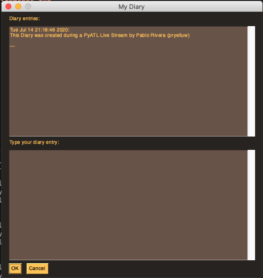

# programming101-ep5
programming101 ep5

Create GUI application with PySimpleGUI and previous diary sample program.

Diary is a GUI program that allows us to create diary entries.
It also allows us to read whatever entries are available.

Requires Python 3.6+

To install:

Create a new virtual environment.

On mac:

`python3 -m venv .venv`

Activate the virtual environment:

`source .venv/bin/activate`

Install the required dependencies:

`pip install -r requirements.txt`

Run:

`python3 main.py`

